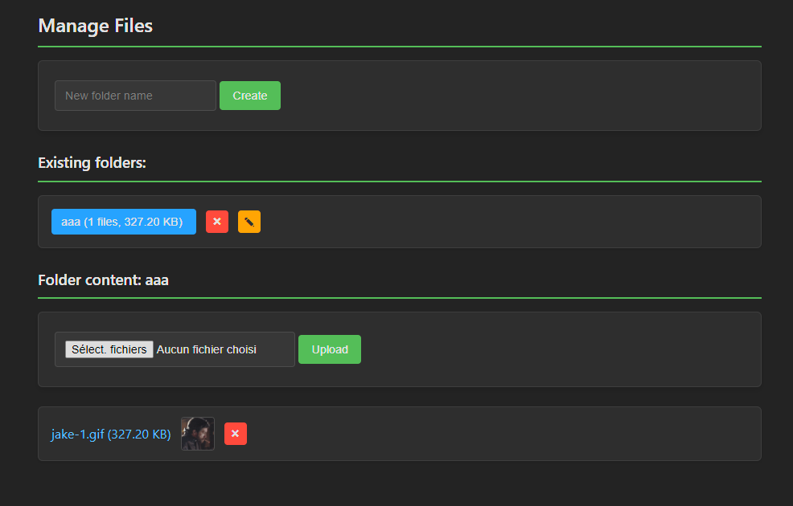

# File Hoster

A simple web-based file management system that allows you to organize, upload, and manage files through a browser interface.

## Preview



## ⚠️ SECURITY WARNING ⚠️

**This application is designed for localhost use only!**

- There is NO authentication or authorization
- Anyone with access to the server can view, modify, or delete ALL files
- Do NOT expose this application to the internet or untrusted networks
- This tool is intended for personal use on trusted networks only

## Installation

1. Install dependencies:
```bash
pip install flask
```

2. Configure the application:
- Open `conf.py` and modify the settings to match your environment:
    - `BASE_DIR` : Directory where files will be stored
    - `HOST` : Server host (default: 0.0.0.0)
    - `PORT` : Server port (default: 8090)
    - `FILES_PER_REQUEST` : Number of files to load per request
    - `DEBUG` : Enable/disable debug mode
    - `DEFAULT_LANGUAGE` : Default language if browser language cannot be detected


### Accessing the application

Open your web browser and navigate to:
```
http://<HOST>:<PORT>
http://localhost:8090 (Default)
```

## Running as a systemd service

To run File Hoster as a systemd service on Linux:

1. Create a systemd service file:

```bash
sudo nano /etc/systemd/system/filehoster.service
```

2. Add the following content (adjust paths as needed):

```
[Unit]
Description=File Hoster Web Application
After=network.target

[Service]
User=yourusername
WorkingDirectory=/path/to/file-hoster
ExecStart=/usr/bin/python3 app.py
Restart=always

[Install]
WantedBy=multi-user.target
```

3. Enable and start the service:

```bash
sudo systemctl enable filehoster.service
sudo systemctl start filehoster.service
```

4. Check the status:

```bash
sudo systemctl status filehoster.service
```

## Adding more languages


1. Open `languages.py`
2. Add a new language entry to the `TRANSLATIONS` dictionary. For example, to add Spanish:
```py
'es': {
    'manage_files': 'Administrar archivos',
    'create': 'Crear',
    'existing_folders': 'Carpetas existentes',
    # Add all required translation keys here
}
```
3. The application will automatically detect supported languages based on the browser settings